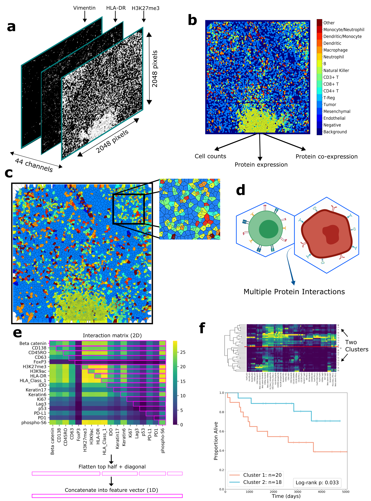

# rasp-mibi: Recurrence And Survival Prediction via Multiplexed Ion Beam Imaging
This repository contains the code for the article, "Multiplexed Analysis of the Tumor-Immune Microenvironment Reveals Predictors of Outcome in Triple-Negative Breast Cancer"

## Software Requirements
This code was dveloped in the following settings.

### OS
* MacOS 10.14.6

### Processor
* Intel Core i5

### Dependencies
* python (3.7.3)
* numpy (1.16.4)
* pandas (0.24.2)
* opencv-python (3.4.2.16)
* Pillow (6.0.0)
* scikit-image (0.15.0)
* scipy (1.4.1)
* matplotlib (3.1.0)
* lifelines (0.24.0)
* seaborn (0.10.1)
* statsmodels (0.11.1)
* pysurvival (0.1.2)
* scikit-image (0.15.0)
* shap (0.37.0)

## Installation
To install the required packages, you can download the required packages individually using: 
`pip3 install package_name`  
or, alternatively, use the requirements.txt file: 
`pip3 install -r requirements.txt`  

Download the repository as a whole to run the demos.

## Demo

